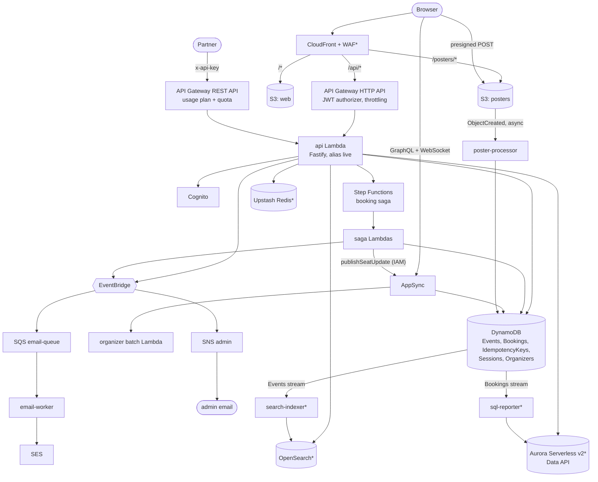
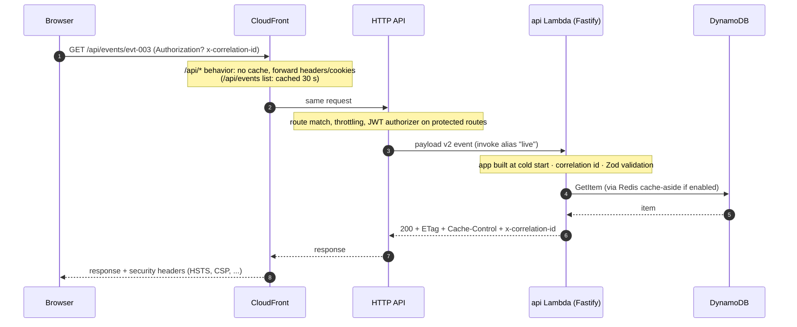
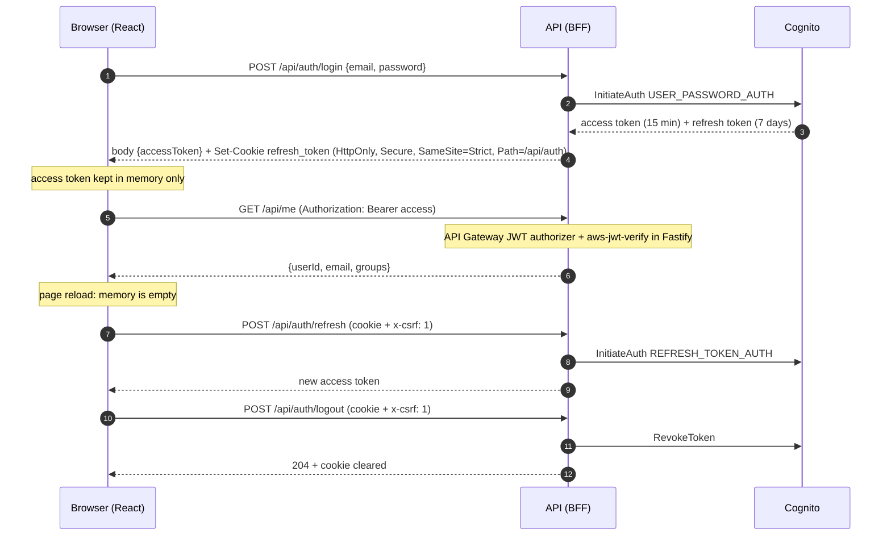
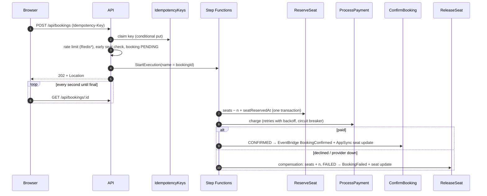
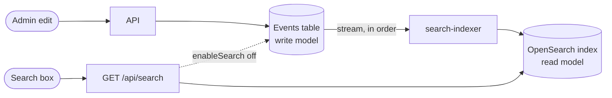
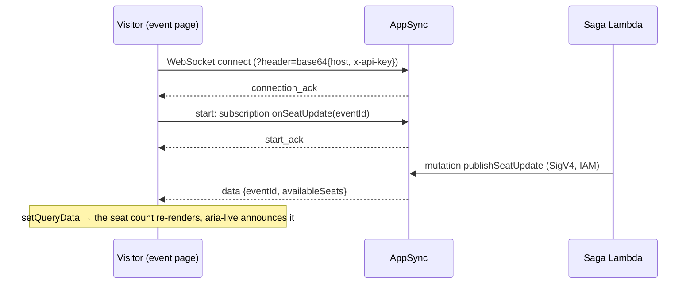
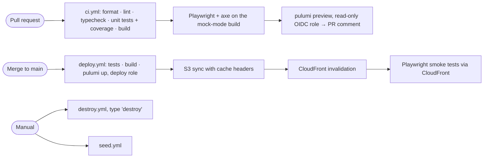

# Architecture

TicketLite is a serverless web app on AWS. One CloudFront domain serves the static Next.js site and forwards
`/api/*` to an HTTP API in front of one Fastify Lambda ("Lambdalith"). Long-running or asynchronous work runs in
small single-purpose Lambdas: a Step Functions saga, queue and stream consumers. AppSync adds GraphQL reads and
real-time seat counts. Everything is defined in Pulumi (`infra/`) and deployed only by GitHub Actions.

Diagrams are Mermaid, so they render on GitHub and in VS Code (with a Mermaid preview extension).

## 1. Overview

`*` = behind a cost flag that defaults to `false` (`infra/Pulumi.dev.yaml`).

## 2. Request path

Code: `infra/cdn.ts`, `infra/http-routes.ts`, `api/src/lambda.ts`, `api/src/app.ts`, `api/src/routes/events.ts`.

## 3. Authentication (BFF with Cognito)

The **authorization code + PKCE** demo (`/api/auth/oauth/start` → Cognito managed login → `/api/auth/oauth/callback`)
ends in the same refresh cookie. The **session demo** (`/api/demo/session/*`) stores sessions in DynamoDB instead.
Code: `api/src/routes/auth.ts`, `oauth.ts`, `demo-session.ts`, `web/src/lib/api-client.ts`, `infra/cognito.ts`.

## 4. Booking saga

State machine: [infra/booking-state-machine.md](../infra/booking-state-machine.md) (diagram + every state).
ADRs: [0004 orchestration](adr/0004-saga-orchestration.md), [0005 Standard workflow](adr/0005-standard-workflow.md).

## 5. Event-driven flow

See [EVENT-DRIVEN.md](EVENT-DRIVEN.md): EventBridge → SQS (+DLQ) → email-worker → SES; EventBridge → SNS fan-out;
S3 → poster-processor (async, on-failure queue); DynamoDB streams → indexer/reporter.

## 6. Search (CQRS)

Details: [SEARCH.md](SEARCH.md).

## 7. Real-time seat updates

Code: `graphql/schema.graphql`, `functions/shared/appsync.ts`, `web/src/lib/appsync-realtime.ts`,
`web/src/features/events/live-seats.ts`. ADR: [0006 GraphQL client](adr/0006-graphql-client.md).

## 8. CI/CD

No AWS keys exist anywhere: GitHub's OIDC token is exchanged for short-lived role credentials
(`bootstrap/`, [CICD-SETUP.md](CICD-SETUP.md)).

## 9. Code layout

| Layer | Folder | Rule |
|---|---|---|
| Shared contracts | `packages/shared` | Zod schemas = runtime validation + TypeScript types, used by API and web |
| HTTP | `api/src/routes` | Parse/validate, call a service, set status and headers |
| Logic | `api/src/services` | No HTTP, no AWS SDK |
| Data | `api/src/repositories` | One file per table, access patterns listed at the top |
| AWS clients | `api/src/lib`, `functions/shared` | Created once per cold start, short timeouts |
| Async workers | `functions/<name>` | One job each, README with trigger, retries, failure destination, IAM |
| Infra | `infra/<area>.ts` | One file per service area; `index.ts` only wires and exports |
