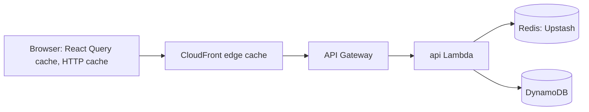

# Caching and rate limiting

Code: `api/src/lib/cache.ts`, `api/src/lib/redis.ts`, `api/src/services/event-cache.ts`,
`api/src/services/rate-limit-service.ts`, `infra/cdn.ts`, `infra/http-routes.ts`, `web/src/lib/query-client.ts`.

## Where each cache sits

| Layer | What is cached | TTL / rule | Invalidation |
|---|---|---|---|
| React Query (browser memory) | Every API response | `staleTime` 30 s | `invalidateQueries` after mutations; `setQueryData` for live seats |
| Browser HTTP cache | `/api/events` (`max-age=30`), event detail (ETag, revalidate every time) | `Cache-Control` | ETag → 304 |
| CloudFront | Static assets (1 year, immutable), HTML (60 s), `GET /api/events` (30 s, key = query string) | Cache policies | Deploy invalidates `/*`; the API list simply expires |
| Redis (flag `enableCache`) | Event detail (`event:<id>`) | 10 s | Deleted on admin update |

## Patterns

- **Cache-aside** (used): the app reads the cache, on a miss reads the database and fills the cache. Simple, and the
  cache can fail without breaking anything.
- **Read-through**: the cache itself loads from the database on a miss (e.g. DAX for DynamoDB). Less app code, more
  coupling.
- **Write-through**: every write goes to cache and database together. Cache always fresh, writes slower.
- **Write-behind**: write to the cache, flush to the database later. Fast writes, risk of loss.
- **TTL** bounds staleness; **invalidation** (delete on update) removes known-stale entries early. Seat counts change
  with every booking, so the TTL is short (10 s) and live updates come from AppSync.
- **Eviction (LRU)**: when memory is full Redis evicts the least recently used keys (`maxmemory-policy allkeys-lru`).
- **Stampede protection**: when a hot key expires, only the request holding a short `SET NX PX` lock rebuilds it;
  the others wait 100 ms and read the rebuilt value.
- **Null object**: with the flag off, a `NoopCache` with the same interface makes every read a miss. No `if` in callers.

## Rate limiting

- **API Gateway throttling** (token bucket): stage default 20 rps / burst 40; `POST /api/bookings` 5 rps / burst 10.
- **Per-user sliding window** in Redis: max 5 booking attempts per 60 s → 429 + `Retry-After`. A sorted set per user
  avoids the fixed-window "double burst" at the boundary. Fails open if Redis is down; skipped when the flag is off.

## ElastiCache vs Upstash

| | ElastiCache (Redis/Valkey) | Upstash (serverless Redis) |
|---|---|---|
| Network | Inside a VPC: the Lambda must join the VPC; reaching other AWS APIs then needs NAT gateways (~$32/month each) or VPC endpoints | Public TLS endpoint: Lambdas stay outside a VPC |
| Pricing | Per node-hour (or ElastiCache Serverless minimums), even idle | Per request, free tier, $0 when idle |
| Latency | Sub-millisecond in-VPC | A few ms over the internet |
| Fit | Steady high traffic, strict network isolation | Spiky / low traffic, serverless apps like this one |

Enable it: create a free Upstash database, set `enableCache: true`, deploy, then put the `rediss://` URL into the
`upstash-redis-url` secret (docs/CICD-SETUP.md).
