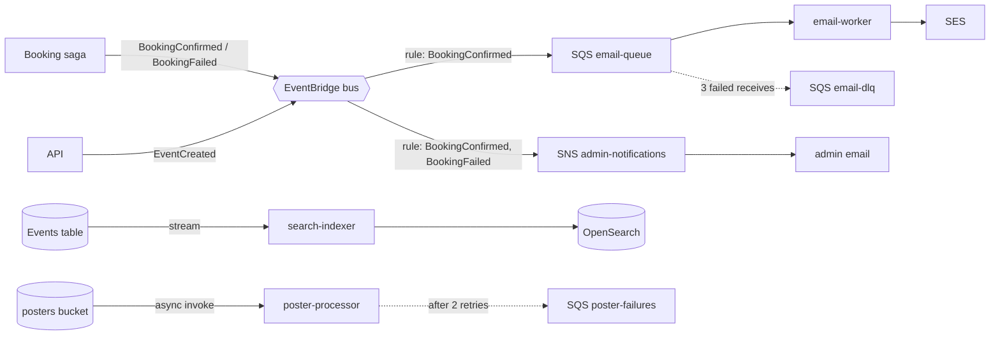

# Event-driven processing

How TicketLite reacts to things that happened, without the caller waiting. Code: `infra/events.ts`,
`functions/email-worker`, `functions/search-indexer`, `functions/poster-processor`, `functions/shared/eventbridge.ts`.

## Which service for which job?

| Service | Model | Ordering | Retention / replay | Use it when | In TicketLite |
|---|---|---|---|---|---|
| **SQS** | Queue: one consumer group pulls messages | Standard: best effort (FIFO queues: strict per group) | Up to 14 days; DLQ for failures | Buffer work, absorb spikes, retry a consumer that may fail | `email-queue` (+ DLQ), `poster-failures`, `search-indexer-failures` |
| **SNS** | Pub/sub push: every subscriber gets a copy (fan-out) | None (FIFO topics exist) | None (deliver now or retry) | Notify many endpoints (email, SMS, HTTP, SQS) | `admin-notifications` (email), alarm topic (M6) |
| **EventBridge** | Event bus + content-based routing rules | None | Optional archive + replay | Decouple producers from consumers; route by event content; SaaS/AWS events | Custom bus `ticketlite-<stage>`: BookingConfirmed/Failed, EventCreated |
| **DynamoDB Streams** | Change log of one table, read by Lambda in order per item | Per item (per shard) | 24 hours | React to every change of a table (CDC), build read models | Events table → search-indexer (CQRS) |
| **Kinesis Data Streams** | Partitioned log, many independent readers | Per partition key | 1–365 days, replay any time | High-throughput streams (clicks, telemetry), multiple consumers re-reading | Not used: our volume is tiny. Would replace the stream if we needed many readers or replay |

## Patterns used

- **Choreography for side effects** (emails, notifications, indexing): publishers don't know the consumers. The
  booking itself is **orchestrated** (Step Functions), see `docs/adr/0004-saga-orchestration.md`.
- **At-least-once delivery → idempotent consumers**: the email worker checks `emailSentAt`; the indexer's upsert is
  naturally idempotent.
- **Partial batch responses** (SQS and streams): only failed records are retried.
- **Poison messages**: SQS moves them to a DLQ after `maxReceiveCount`; streams use `bisectBatchOnFunctionError` +
  `maximumRetryAttempts` + an on-failure destination so one bad record can't block a shard forever.
- **Async invocation** (S3 → poster-processor): Lambda's internal queue retries twice, then the on-failure destination.
- **Visibility timeout > function timeout** (60 s vs 10 s), so a message isn't handed to a second copy while the first
  is still working.

Redrive and inspection: [RUNBOOK.md](RUNBOOK.md#dead-letter-queues).
