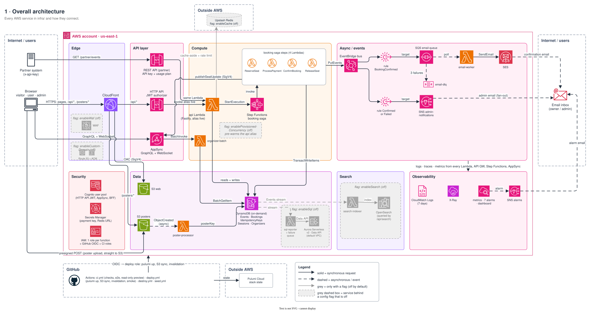
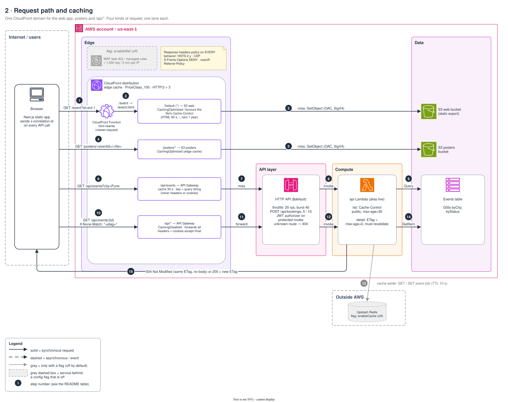
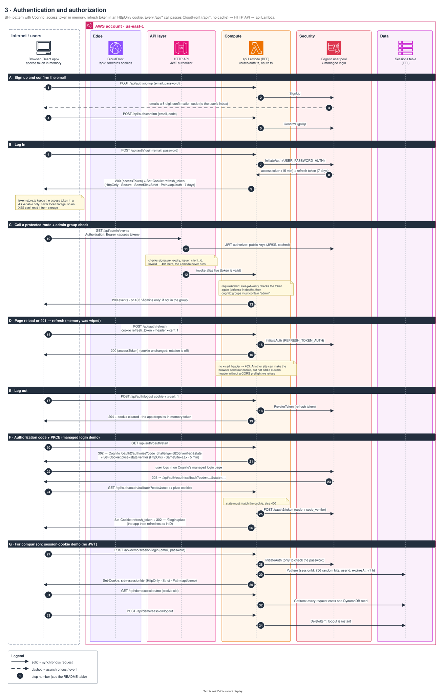
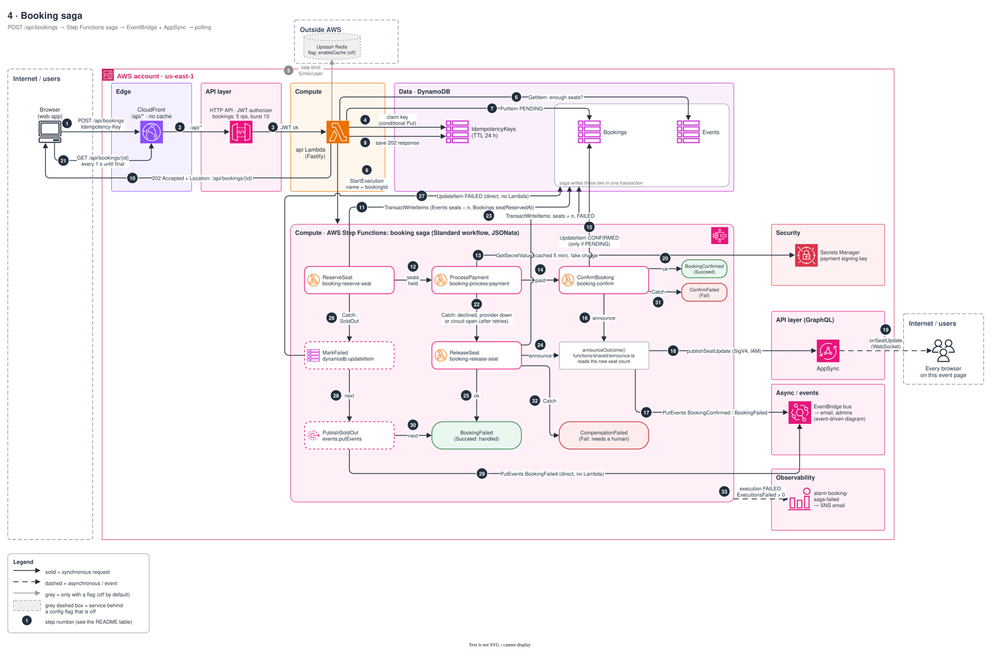
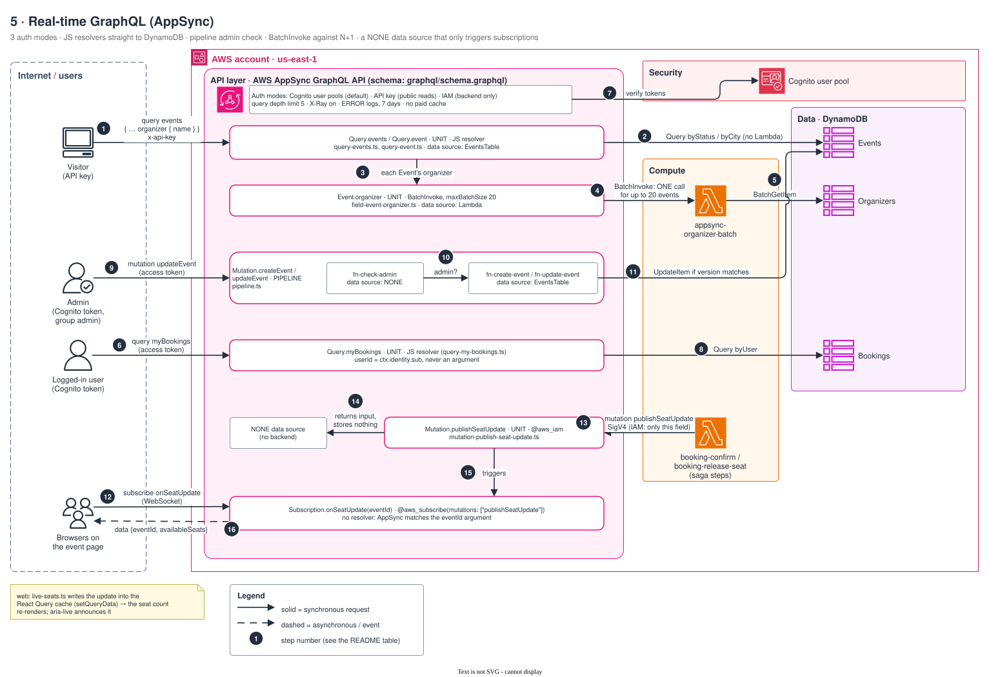
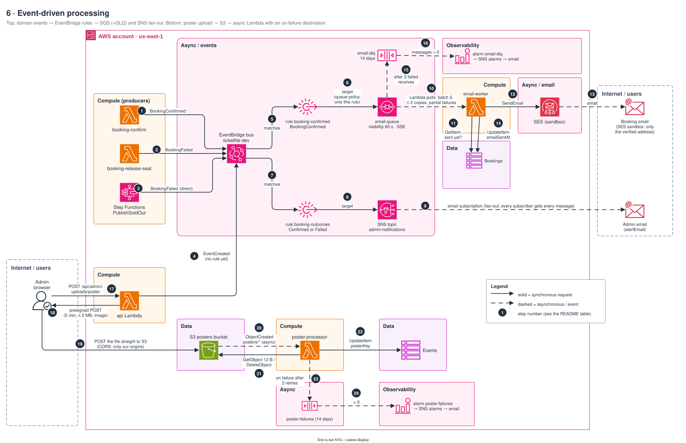
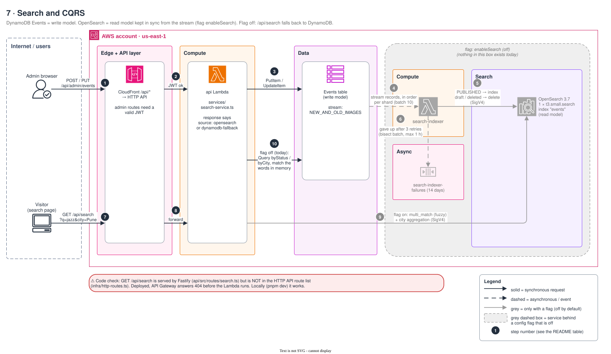
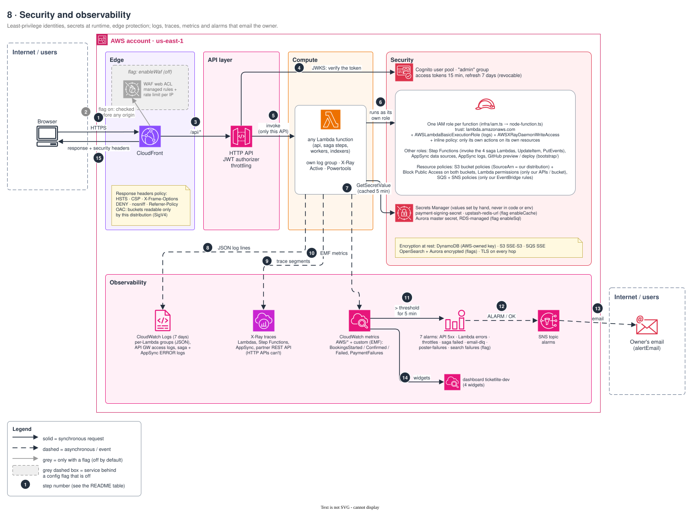
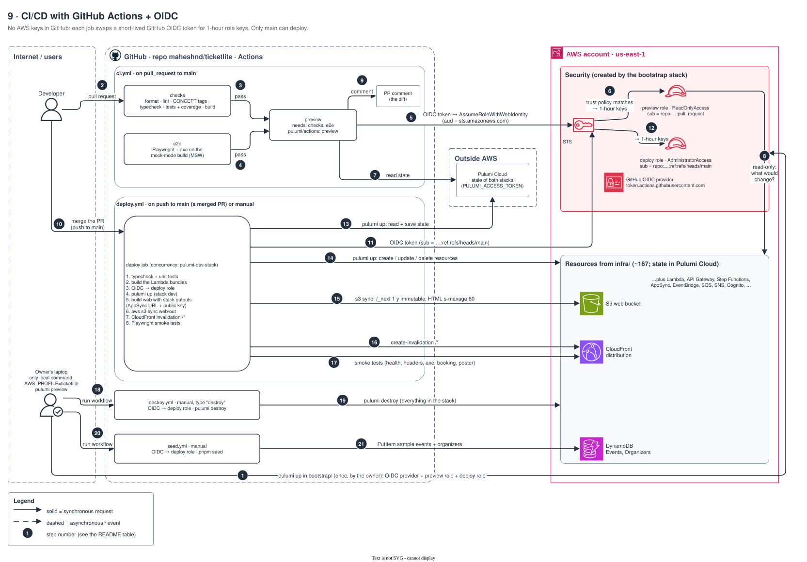

# Architecture diagrams

Nine draw.io diagrams of TicketLite, drawn from the code in `infra/`, `api/`, `functions/`, `graphql/` and `web/`.
Where the code and `BUILD-SPEC.md` differ, the diagrams follow the code.

**How to read them**
- Solid arrow = a synchronous request (the caller waits). Dashed arrow = asynchronous (an event, a queue, a stream).
- The numbered circles give the order. Each section below has a table with one row per number.
- Grey icons inside a grey dashed box sit behind a cost flag that is off by default (`infra/Pulumi.dev.yaml`):
  `enableSearch`, `enableCache`, `enableSql`, `enableWaf`, `enableCustomDomain`, `enableProvisionedConcurrency`.
  Grey arrows only exist when that flag is on.
- Diagram 1 has no numbers: it is a map of the whole system. Diagrams 2–9 number each flow.

**How to edit them.** Each `.drawio.svg` is an SVG image that also holds the editable diagram. GitHub shows it as an
image. In VS Code, the "Draw.io Integration" extension (`hediet.vscode-drawio`) opens it as an editable diagram;
save, and the image updates too. The icons come from draw.io's AWS 2024+ library (`mxgraph.aws4.*`).

**Code checks found while drawing.** These are shown in the diagrams the way the code works today:
1. The `api` Lambda's IAM policy (`infra/lambdas.ts`) only allows the Events, Organizers and Sessions tables.
   The api also writes Bookings and IdempotencyKeys, calls `states:StartExecution` and `events:PutEvents`, signs S3
   presigned POSTs, and (with flags on) reads the Redis secret, calls OpenSearch and the RDS Data API. Once deployed,
   those calls get AccessDenied. Local dev doesn't show this because it uses your own credentials.
   (`sql.apiStatements` is built in `infra/sql.ts` but never used.)
2. `GET /api/search` and `GET /api/admin/reports` are Fastify routes but are missing from the route list in
   `infra/http-routes.ts`, so API Gateway answers 404 before the Lambda runs.

Contents: [1 Overall](#1-overall-architecture) · [2 Request path](#2-request-path-and-caching) ·
[3 Auth](#3-auth-flow) · [4 Booking saga](#4-booking-saga) · [5 Real-time GraphQL](#5-real-time-graphql) ·
[6 Event-driven](#6-event-driven) · [7 Search](#7-search-and-cqrs) ·
[8 Security + observability](#8-security-and-observability) · [9 CI/CD](#9-cicd) ·
[Coverage check](#coverage-check)

---

## 1. Overall architecture

One CloudFront domain serves the static web app, posters and `/api/*`. The `/api/*` path goes through an HTTP API to
one Fastify Lambda (the "Lambdalith"). Partners use a separate REST API with API keys. Browsers also talk straight to
AppSync (GraphQL and live seat updates) and upload posters straight to S3. A booking runs as a Step Functions saga.
Its outcome becomes an EventBridge event that fans out to email (SQS → worker → SES) and admin alerts (SNS).
DynamoDB streams feed the optional search index and SQL reports.

| Part | What it is | AWS service | File(s) |
|---|---|---|---|
| Edge | Single entry point, edge cache, security headers, URL rewrite; WAF and a custom domain behind flags | CloudFront, WAF, ACM, Route 53 | `infra/cdn.ts`, `infra/cdn-policies.ts`, `infra/cdn-rewrite.js`, `infra/waf.ts`, `infra/domain.ts` |
| API layer | HTTP API (JWT authorizer, throttling), partner REST API (key + usage plan), AppSync GraphQL | API Gateway v2 + v1, AppSync | `infra/http-api.ts`, `infra/http-routes.ts`, `infra/partner-api.ts`, `infra/appsync.ts`, `infra/appsync-resolvers.ts` |
| Compute | api Lambda (alias `live`), booking saga (4 Lambdas), organizer-batch | Lambda, Step Functions | `infra/lambdas.ts`, `infra/node-function.ts`, `infra/stepfunctions.ts`, `api/src/`, `functions/` |
| Async / events | Bus + 2 rules, email queue + DLQ, email worker, SES, admin topic | EventBridge, SQS, Lambda, SES, SNS | `infra/events.ts`, `functions/email-worker/` |
| Data | 5 tables (2 streams), 2 private buckets, poster-processor; Aurora behind a flag | DynamoDB, S3, Lambda, Aurora Serverless v2 | `infra/dynamodb.ts`, `infra/storage.ts`, `infra/uploads.ts`, `infra/sql.ts` |
| Search | Stream → indexer → OpenSearch (flag) | Lambda, OpenSearch Service | `infra/search.ts`, `functions/search-indexer/` |
| Security | Users and tokens, secrets, one IAM role per function | Cognito, Secrets Manager, IAM | `infra/cognito.ts`, `infra/secrets.ts`, `infra/iam.ts` |
| Observability | Logs (7 days), traces, metrics, 7 alarms → email, dashboard | CloudWatch, X-Ray, SNS | `infra/observability.ts`, `functions/shared/powertools.ts`, `api/src/lib/metrics.ts` |
| Outside AWS | Redis cache (flag), Pulumi state, GitHub Actions | Upstash, Pulumi Cloud, GitHub | `api/src/lib/redis.ts`, `.github/workflows/` |

**What can fail here and what happens then**
- One Lambda serves every REST route, so a bad api deploy breaks the whole REST API. Roll back by pointing the `live` alias at the previous version (docs/RUNBOOK.md).
- Each optional service degrades instead of failing: no Redis → every read is a cache miss; no OpenSearch → DynamoDB fallback search; no SQL → `/api/admin/reports` returns 404.
- Async consumers (email, posters, indexers) retry. When they give up, the message lands in a DLQ or failure queue, and an alarm emails the owner.

---

## 2. Request path and caching

| Step | What happens (plain simple English) | AWS service | File(s) that do it |
|---|---|---|---|
| 1 | The browser asks for a page, e.g. `/event?id=evt-1`. | CloudFront | `web/src/app/event/page.tsx` |
| 2 | A tiny CloudFront Function rewrites `/event` to `/event.html`, because a static export has one file per page. | CloudFront Functions | `infra/cdn-rewrite.js`, `infra/cdn-policies.ts` |
| 3 | On a cache miss CloudFront reads the file from the private web bucket, signing the request (Origin Access Control). HTML is cached 60 s at the edge, `/_next/*` files for a year. | S3 | `infra/cdn.ts`, `infra/storage.ts`, `.github/workflows/deploy.yml` (Cache-Control) |
| 4 | The browser asks for a poster image. | CloudFront | `web/src/features/events/EventDetail.tsx` |
| 5 | On a miss CloudFront reads it from the private posters bucket (OAC). | S3 | `infra/cdn.ts` |
| 6 | The browser asks for the public events list. The `/api/events` behavior caches it for 30 s, keyed on the query string only (never cookies), so users can't see each other's data. | CloudFront | `infra/cdn-policies.ts` (`eventsListCache`), `web/src/features/events/events-api.ts` |
| 7 | On a miss the request goes to API Gateway. | API Gateway (HTTP API) | `infra/cdn.ts` |
| 8 | API Gateway checks the route and throttles (20 requests/s, bursts of 40), then invokes the api Lambda's `live` alias. | API Gateway, Lambda | `infra/http-routes.ts` |
| 9 | The Lambda runs a DynamoDB Query on the `byCity` or `byStatus` index and returns `Cache-Control: public, max-age=30`. | DynamoDB | `api/src/routes/events.ts`, `api/src/repositories/events-repository.ts` |
| 10 | The browser asks for one event and sends the ETag it already has (`If-None-Match`). | CloudFront | `web/src/features/events/events-api.ts` |
| 11 | `/api/*` is never cached: CloudFront forwards every header and cookie except Host. | CloudFront | `infra/cdn.ts` (`CACHING_DISABLED`, `ALL_VIEWER_EXCEPT_HOST`) |
| 12 | API Gateway invokes the Lambda. | API Gateway, Lambda | `infra/http-routes.ts` |
| 13 | (flag `enableCache`) Cache-aside: look in Redis first. On a miss, take a short lock so only one request rebuilds the entry, then store it for 10 s. | Upstash Redis (not AWS) | `api/src/services/event-cache.ts`, `api/src/lib/cache.ts`, `api/src/lib/redis.ts` |
| 14 | On a cache miss (always, while the flag is off) the Lambda runs a DynamoDB GetItem. | DynamoDB | `api/src/services/events-service.ts` |
| 15 | Same ETag → `304 Not Modified` with no body; otherwise `200` with a new ETag. Every response gets the security headers (HSTS, CSP, …). | CloudFront | `api/src/routes/events.ts`, `infra/cdn-policies.ts` (`securityHeaders`) |

**What can fail here and what happens then**
- Too many requests → API Gateway answers 429 before any Lambda runs (cheap). With `enableWaf`, WAF blocks an IP after 1,000 requests in 5 minutes.
- Redis slow or down → its 300 ms command timeout fires, the error counts as a miss, and DynamoDB answers. Slower, but correct.
- An unknown path under `/api/*` → API Gateway returns 404 itself. This currently includes `/api/search` and `/api/admin/reports` (see "Code checks").
- A stale list is possible for up to 30 s (by design). Seat counts on the detail page stay fresh through the ETag check and AppSync updates.

---

## 3. Auth flow

Every `/api/*` call below passes CloudFront (`/api/*`, no cache) and the HTTP API before it reaches the Lambda. Most
arrows skip those hops; section C draws them because the JWT authorizer does real work there.

| Step | What happens (plain simple English) | AWS service | File(s) that do it |
|---|---|---|---|
| 1 | The user signs up with email and password. | API Gateway, Lambda | `web/src/features/auth/SignupForm.tsx`, `api/src/routes/auth.ts` |
| 2 | The API (the "backend for frontend", BFF) calls Cognito SignUp. Cognito hashes and stores the password. | Cognito | `api/src/services/auth-service.ts`, `api/src/lib/cognito.ts`, `infra/cognito.ts` |
| 3 | Cognito emails a confirmation code (its free built-in sender). | Cognito | `infra/cognito.ts` (`COGNITO_DEFAULT`) |
| 4 | The user types the code. | Lambda | `web/src/features/auth/ConfirmForm.tsx` |
| 5 | The API calls ConfirmSignUp. | Cognito | `api/src/services/auth-service.ts` |
| 6 | The user logs in. | Lambda | `web/src/features/auth/LoginForm.tsx` |
| 7 | The API calls InitiateAuth with `USER_PASSWORD_AUTH`. | Cognito | `api/src/lib/cognito.ts` |
| 8 | Cognito returns an access token (15 min) and a refresh token (7 days). | Cognito | `infra/cognito.ts` (token validity) |
| 9 | The access token goes in the response body. The refresh token goes in an HttpOnly, Secure, SameSite=Strict cookie limited to `/api/auth`. The web app keeps the access token in memory only. | Lambda | `api/src/routes/auth.ts` (`sendTokens`), `web/src/lib/token-store.ts` |
| 10 | The browser calls a protected route with `Authorization: Bearer <access token>`. | API Gateway | `web/src/lib/api-client.ts` |
| 11 | The JWT authorizer checks the token against Cognito's public keys (JWKS, cached), plus expiry, issuer and client id. A bad token gets 401 and the Lambda never runs. | API Gateway, Cognito | `infra/http-routes.ts` (`jwtAuthorizer`) |
| 12 | API Gateway invokes the Lambda. | Lambda | `infra/http-routes.ts` |
| 13 | Fastify checks the token again (defense in depth), then `requireAdmin` looks for `admin` in `cognito:groups`. Not there → 403. | Lambda | `api/src/plugins/auth-context.ts`, `api/src/lib/jwt.ts` |
| 14 | After a page reload (memory is empty) or a 401, the app calls refresh with the cookie and the header `x-csrf: 1`. | Lambda | `web/src/features/auth/auth-context.tsx`, `web/src/lib/api-client.ts` |
| 15 | The API calls InitiateAuth with `REFRESH_TOKEN_AUTH`. | Cognito | `api/src/services/auth-service.ts` |
| 16 | A new access token comes back. The cookie stays the same (refresh-token rotation is off). | Lambda | `api/src/routes/auth.ts` |
| 17 | Logout sends the cookie and `x-csrf: 1`. | Lambda | `api/src/routes/auth.ts` |
| 18 | The API revokes the refresh token. | Cognito | `api/src/lib/cognito.ts` (`revokeRefreshToken`) |
| 19 | 204, the cookie is cleared, and the app forgets the access token. | Lambda | `api/src/routes/auth.ts` |
| 20 | PKCE demo: the browser opens `/api/auth/oauth/start`. | Lambda | `api/src/routes/oauth.ts` |
| 21 | The API creates a random verifier and state, keeps them in a short HttpOnly `pkce` cookie (SameSite=Lax, 5 min), and redirects to Cognito with `code_challenge = SHA-256(verifier)`. | Lambda | `api/src/services/pkce.ts`, `api/src/lib/cognito-oauth.ts` |
| 22 | The user logs in on Cognito's managed login page. | Cognito (managed login) | `infra/cognito.ts` (`UserPoolDomain`, `ManagedLoginBranding`) |
| 23 | Cognito redirects back with a one-time `code` and the `state`. | Cognito | — |
| 24 | The browser follows the redirect to the callback (the `pkce` cookie goes with it). | Lambda | `api/src/routes/oauth.ts` |
| 25 | The state must match the cookie. Then the API swaps code + verifier for tokens, server to server. | Cognito | `api/src/lib/cognito-oauth.ts` (`exchangeCode`) |
| 26 | The refresh cookie is set and the browser is sent to `/?login=pkce`. The app then refreshes as in step 14. | Lambda | `api/src/routes/oauth.ts` |
| 27 | Session demo: log in with email and password. | Lambda | `api/src/routes/demo-session.ts` |
| 28 | Cognito checks the password. | Cognito | `api/src/services/session-service.ts` |
| 29 | The API stores its own session row: a random 256-bit id, the userId, and expiry in 1 hour (TTL). | DynamoDB | `api/src/repositories/sessions-repository.ts`, `infra/dynamodb.ts` |
| 30 | The cookie `sid` holds only that random id. | Lambda | `api/src/routes/demo-session.ts` |
| 31 | `/me` sends the cookie… | Lambda | `api/src/routes/demo-session.ts` |
| 32 | …and every request costs one DynamoDB read: the price of sessions. | DynamoDB | `api/src/services/session-service.ts` |
| 33 | Logout… | Lambda | `api/src/routes/demo-session.ts` |
| 34 | …deletes the row, so the very next request fails: instant logout, which a JWT can't do. | DynamoDB | `api/src/repositories/sessions-repository.ts` |

**What can fail here and what happens then**
- A wrong password, an unknown email or a wrong code all get vague answers ("wrong email or password"), so nobody can find out which emails have accounts. Too many tries → 429.
- An expired access token → 401. The api-client refreshes once and retries the request. If the refresh fails too, the user is logged out.
- A request from another site can carry the cookie, but it can't add `x-csrf`, so refresh and logout answer 403.
- A stolen access token works until it expires (15 min at most). Logout revokes the refresh token, so no new access tokens can be minted.

---

## 4. Booking saga

| Step | What happens (plain simple English) | AWS service | File(s) that do it |
|---|---|---|---|
| 1 | The user clicks Book. The app sends one random `Idempotency-Key` per attempt (reused if the user retries). | CloudFront | `web/src/features/bookings/use-book-event.ts` |
| 2 | `/api/*` goes to API Gateway, uncached. | API Gateway | `infra/cdn.ts` |
| 3 | The JWT authorizer passes. This route is throttled to 5 requests/s (bursts of 10). | API Gateway, Lambda | `infra/http-routes.ts` |
| 4 | The API claims the key with a conditional PutItem. Same key and same body → replay the stored answer. Same key, different body → 422. Still running → 409. | DynamoDB | `api/src/services/idempotency-service.ts`, `api/src/repositories/idempotency-repository.ts` |
| 5 | (flag `enableCache`) Sliding-window rate limit: 5 bookings per minute per user, else 429 with Retry-After. | Upstash Redis | `api/src/services/rate-limit-service.ts` |
| 6 | A quick, strongly consistent seat check for an instant "sold out" answer. It's not the guarantee; step 11 is. | DynamoDB | `api/src/services/bookings-service.ts` |
| 7 | The booking is saved as `PENDING`. | DynamoDB | `api/src/repositories/bookings-repository.ts` |
| 8 | Start the state machine. The execution name is the bookingId, so one booking can never start two sagas. | Step Functions | `api/src/lib/stepfunctions.ts`, `infra/stepfunctions.ts` |
| 9 | The 202 response is stored under the idempotency key for future retries. | DynamoDB | `api/src/services/idempotency-service.ts` |
| 10 | `202 Accepted` + `Location: /api/bookings/{id}`. The work continues in the background. | Lambda | `api/src/routes/bookings.ts` |
| 11 | ReserveSeat: ONE transaction takes the seats (only if enough are left) and marks the booking `seatReservedAt`. A retry finds the mark and does nothing twice. | Step Functions, Lambda, DynamoDB | `functions/booking-reserve-seat/handler.ts`, `infra/booking-state-machine.asl.json` |
| 12 | Seats are held, so go to payment. | Step Functions | `infra/booking-state-machine.asl.json` |
| 13 | ProcessPayment reads the signing key (cached 5 min) and charges a fake provider. "Provider down" is retried 3 times with backoff; a circuit breaker fails fast after 3 failures. Amounts ending in .13 are always declined. | Lambda, Secrets Manager | `functions/booking-process-payment/handler.ts`, `circuit-breaker.ts`, `infra/secrets.ts` |
| 14 | Paid, so confirm. | Step Functions | `infra/booking-state-machine.asl.json` |
| 15 | ConfirmBooking sets `CONFIRMED`, but only if the booking is still `PENDING`. | Lambda, DynamoDB | `functions/booking-confirm/handler.ts` |
| 16 | It then announces the outcome. | Lambda | `functions/shared/announce.ts` |
| 17 | PutEvents `BookingConfirmed` (or `BookingFailed`) on the bus: email and admin alerts follow (diagram 6). | EventBridge | `functions/shared/eventbridge.ts` |
| 18 | It reads the new seat count and calls the IAM-only mutation `publishSeatUpdate`, signed with SigV4. Best effort: a failure only logs a warning. | AppSync | `functions/shared/appsync.ts` |
| 19 | AppSync pushes the new seat count to every browser watching that event. | AppSync (WebSocket) | `web/src/features/events/live-seats.ts`, `web/src/lib/appsync-realtime.ts` |
| 20 | The execution ends in `BookingConfirmed` (Succeed). | Step Functions | `infra/booking-state-machine.asl.json` |
| 21 | Meanwhile the booking page polls `GET /api/bookings/{id}` every second until the status is final. | CloudFront → API Gateway → Lambda → DynamoDB | `web/src/features/bookings/bookings-queries.ts`, `BookingStatus.tsx` |
| 22 | Payment failed (declined, provider still down after retries, or circuit open) → Catch → compensation. | Step Functions | `infra/booking-state-machine.asl.json` |
| 23 | ReleaseSeat: ONE transaction gives the seats back and sets `FAILED`, only if seats were reserved and not yet released. | Lambda, DynamoDB | `functions/booking-release-seat/handler.ts` |
| 24 | It announces `BookingFailed` and the new seat count (steps 17–19 again). | Lambda | `functions/shared/announce.ts` |
| 25 | The execution ends in `BookingFailed`, a Succeed state: a handled business failure raises no alarm. | Step Functions | `infra/booking-state-machine.asl.json` |
| 26 | ReserveSeat failed (sold out, or any error after retries) → Catch. No seats were taken, so nothing to undo. | Step Functions | `infra/booking-state-machine.asl.json` |
| 27 | MarkFailed sets `FAILED` with a direct DynamoDB integration (no Lambda). | Step Functions, DynamoDB | `infra/booking-state-machine.asl.json` |
| 28 | Next state. | Step Functions | — |
| 29 | PublishSoldOut sends `BookingFailed` with a direct EventBridge integration (no Lambda). | Step Functions, EventBridge | `infra/booking-state-machine.asl.json` |
| 30 | Ends in `BookingFailed` (Succeed). | Step Functions | — |
| 31 | ConfirmBooking failed 3 times after the payment went through → `ConfirmFailed` (Fail): a human must sort it out. | Step Functions | `infra/booking-state-machine.asl.json` |
| 32 | ReleaseSeat failed 3 times → `CompensationFailed` (Fail): seats may be stuck. | Step Functions | `infra/booking-state-machine.asl.json` |
| 33 | Any Fail state raises `ExecutionsFailed`, the `booking-saga-failed` alarm fires and emails the owner. | CloudWatch, SNS | `infra/observability.ts` |

**What can fail here and what happens then**
- Double clicks and network retries are safe: the idempotency key (step 4), the execution name (step 8) and the conditional writes (steps 11, 15, 23) each stop a duplicate.
- Two users racing for the last seat: DynamoDB's condition `availableSeats >= :seats` lets only one transaction win. The other ends in sold out (26–30).
- If the saga can't start, the booking is marked `FAILED` ("CouldNotStart") and the key is released, so the client can retry with the same key.
- If AppSync is down, live seat counts stop, but bookings still finish. Pages show the right number on their next fetch.

---

## 5. Real-time GraphQL

| Step | What happens (plain simple English) | AWS service | File(s) that do it |
|---|---|---|---|
| 1 | A visitor (not logged in) queries events with the public API key. The key is not a secret; it only identifies public traffic. | AppSync | `web/src/lib/appsync.ts`, `infra/appsync.ts` (`apiKey`) |
| 2 | A JS resolver runs a DynamoDB Query directly: no Lambda, nothing to cold-start. | AppSync, DynamoDB | `graphql/resolvers/query-events.ts`, `query-event.ts`, `infra/appsync-resolvers.ts` |
| 3 | For each Event in the answer, AppSync must resolve its `organizer` field. | AppSync | `graphql/schema.graphql` |
| 4 | BatchInvoke: one Lambda call for up to 20 events instead of one call each. That fixes the N+1 problem. | AppSync, Lambda | `graphql/resolvers/field-event-organizer.ts`, `infra/appsync-resolvers.ts` (`maxBatchSize` 20) |
| 5 | The Lambda fetches each unique organizer once with BatchGetItem and answers in the same order. | DynamoDB | `functions/appsync-organizer-batch/handler.ts` |
| 6 | A logged-in user queries `myBookings` with their Cognito access token (the default auth mode). | AppSync | `graphql/schema.graphql` |
| 7 | AppSync verifies user-pool tokens against Cognito. | Cognito | `infra/appsync.ts` (`userPoolConfig`) |
| 8 | Query `byUser` with the user id taken from the verified token, never from an argument, so nobody can read someone else's bookings. | DynamoDB | `graphql/resolvers/query-my-bookings.ts` |
| 9 | An admin sends `updateEvent` (or `createEvent`). | AppSync | `graphql/schema.graphql` |
| 10 | Pipeline function 1 (NONE data source) stops the request unless `admin` is in the token's groups. | AppSync | `graphql/resolvers/fn-check-admin.ts`, `pipeline.ts` |
| 11 | Pipeline function 2 writes, but only if `version` still matches (optimistic locking). | DynamoDB | `graphql/resolvers/fn-update-event.ts`, `fn-create-event.ts` |
| 12 | Browsers on an event page open a WebSocket and subscribe to `onSeatUpdate(eventId)`. Auth goes base64-encoded in the URL, because browsers can't set WebSocket headers. | AppSync real-time | `web/src/lib/appsync-realtime.ts`, `web/src/features/events/live-seats.ts` |
| 13 | A saga Lambda calls `publishSeatUpdate`, signed with SigV4. The field is `@aws_iam`, and only these two roles may call it. | AppSync, IAM | `functions/shared/appsync.ts`, `infra/stepfunctions.ts` (`appsync:GraphQL` on one field) |
| 14 | Its NONE data source stores nothing: the resolver just returns the input. | AppSync | `graphql/resolvers/mutation-publish-seat-update.ts` |
| 15 | `@aws_subscribe(mutations: ["publishSeatUpdate"])` triggers the subscription. | AppSync | `graphql/schema.graphql` |
| 16 | Only subscribers with the same `eventId` get the message. The page writes it into the React Query cache and re-renders, and aria-live announces it. | AppSync real-time | `web/src/features/events/live-seats.ts` |

**What can fail here and what happens then**
- Wrong auth mode for a field (e.g. a visitor asks for `myBookings`) → AppSync answers Unauthorized in the GraphQL `errors` array, often with HTTP 200.
- A query nested more than 5 levels → rejected before any resolver runs (`queryDepthLimit`).
- The WebSocket drops or keep-alives stop → the client reconnects with backoff (1 s, 2 s, … up to 30 s). Updates sent while it was disconnected are lost, and the next fetch corrects the number.
- `maxBatchSize` set to 0 → the N+1 problem comes back (one Lambda call per event). The logs show `batchSize` either way.

---

## 6. Event-driven

| Step | What happens (plain simple English) | AWS service | File(s) that do it |
|---|---|---|---|
| 1 | booking-confirm publishes `BookingConfirmed` (source `ticketlite.bookings`). | EventBridge | `functions/shared/announce.ts`, `functions/shared/eventbridge.ts` |
| 2 | booking-release-seat publishes `BookingFailed`. | EventBridge | same |
| 3 | The sold-out path publishes `BookingFailed` straight from Step Functions (no Lambda). | Step Functions, EventBridge | `infra/booking-state-machine.asl.json` (`PublishSoldOut`) |
| 4 | The api publishes `EventCreated` (source `ticketlite.events`). No rule matches it yet: new consumers can subscribe without changing the API. | EventBridge | `api/src/lib/eventbridge.ts` |
| 5 | Rule `booking-confirmed` matches detail-type `BookingConfirmed`. | EventBridge | `infra/events.ts` |
| 6 | Its target is the email queue. A queue policy lets only this rule send to it. | SQS | `infra/events.ts` (`QueuePolicy`) |
| 7 | Rule `booking-outcomes` matches both `BookingConfirmed` and `BookingFailed`. | EventBridge | `infra/events.ts` |
| 8 | Its target is the admin topic, also locked down with a topic policy. | SNS | `infra/events.ts` (`TopicPolicy`) |
| 9 | SNS emails every subscriber (fan-out). The subscription must be confirmed once. | SNS | `infra/events.ts` (`TopicSubscription`) |
| 10 | Lambda polls the queue: batches of 5, at most 2 copies at once, partial batch failures reported. | SQS, Lambda | `infra/events.ts` (`EventSourceMapping`) |
| 11 | The worker checks `emailSentAt` first: SQS can deliver a message twice. | DynamoDB | `functions/email-worker/handler.ts` |
| 12 | It sends the email. | SES | `functions/email-worker/handler.ts` |
| 13 | SES is in sandbox mode, so the email goes to the verified address (`sesEmail`), not the user's own address. | SES | `infra/events.ts` (`EmailIdentity`) |
| 14 | It records `emailSentAt`, so a retry won't send a second email. | DynamoDB | `functions/email-worker/handler.ts` |
| 15 | A message that fails 3 receives moves to the DLQ (kept 14 days). | SQS | `infra/events.ts` (`redrivePolicy`) |
| 16 | Any message in the DLQ fires the `email-dlq` alarm → email. | CloudWatch, SNS | `infra/observability.ts` |
| 17 | An admin asks for a poster upload slot. | API Gateway, Lambda | `web/src/features/admin/PosterUpload.tsx`, `api/src/routes/admin-uploads.ts` |
| 18 | The API returns a presigned POST: valid for 5 minutes, one key the server chose, image types only, at most 2 MB. | S3 (signing only, no call) | `api/src/services/posters-service.ts`, `api/src/lib/s3.ts` |
| 19 | The browser POSTs the file straight to S3. The API never handles the bytes. Bucket CORS allows only our origins. | S3 | `infra/uploads.ts` (`BucketCorsConfiguration`) |
| 20 | A new object under `posters/` triggers poster-processor asynchronously: S3 doesn't wait for it. | S3, Lambda | `infra/uploads.ts` (`BucketNotification`) |
| 21 | It reads only the first 12 bytes to check the image type. An invalid file is deleted (not retried). | S3 | `functions/poster-processor/handler.ts`, `image-type.ts` |
| 22 | It sets the event's `posterKey`. | DynamoDB | `functions/poster-processor/handler.ts` |
| 23 | If it throws, Lambda retries twice, then sends the event to the on-failure destination. | Lambda, SQS | `infra/uploads.ts` (`FunctionEventInvokeConfig`) |
| 24 | Any message there fires the `poster-failures` alarm. | CloudWatch | `infra/observability.ts` |

**What can fail here and what happens then**
- SES rejects or throttles → that message alone goes back to the queue (partial batch response), is retried, and after 3 receives lands in the DLQ. The others in the batch aren't resent.
- EventBridge PutEvents fails inside a saga step → the step throws, and Step Functions retries it (the step's writes are idempotent).
- A poster for a deleted event → the condition `attribute_exists(eventId)` fails, and the file is deleted. A wrong file type → deleted, with no retry.
- A failing poster or email never blocks a booking: these are side effects, decoupled by the bus and the queues.

---

## 7. Search and CQRS

| Step | What happens (plain simple English) | AWS service | File(s) that do it |
|---|---|---|---|
| 1 | An admin creates or edits an event. | CloudFront, API Gateway | `web/src/features/admin/EventForm.tsx` |
| 2 | The JWT is valid. Fastify checks the admin group. | API Gateway, Lambda | `api/src/routes/admin-events.ts` |
| 3 | PutItem / UpdateItem on Events, the write model. Updates check `version` (optimistic locking). | DynamoDB | `api/src/services/admin-events-service.ts`, `api/src/repositories/events-repository.ts` |
| 4 | (flag `enableSearch`) The Events stream (NEW_AND_OLD_IMAGES) feeds search-indexer, in order per shard, 10 records at a time. | DynamoDB Streams, Lambda | `infra/search.ts` (`EventSourceMapping`) |
| 5 | PUBLISHED events are indexed. Drafts and deleted events are removed. Requests are signed with SigV4. | OpenSearch | `functions/search-indexer/handler.ts`, `functions/shared/opensearch.ts` |
| 6 | Records that still fail after 3 retries (the batch is split to isolate a bad record, max age 1 h) go to a failure queue, which has an alarm. | SQS | `infra/search.ts`, `infra/observability.ts` |
| 7 | A visitor searches. | CloudFront, API Gateway | `web/src/features/search/search-queries.ts` |
| 8 | Forwarded to the Lambda (but see the note below). | API Gateway, Lambda | `api/src/routes/search.ts` |
| 9 | (flag on) A fuzzy `multi_match` (typos allowed, name counts 3×) plus a city aggregation. The response says `source: "opensearch"`. | OpenSearch | `api/src/services/search-service.ts`, `api/src/lib/opensearch.ts` |
| 10 | (flag off, today) The fallback: one indexed DynamoDB page (never a Scan), with the words matched in memory. The response says `source: "dynamodb-fallback"`. | DynamoDB | `api/src/services/search-service.ts` |

**What can fail here and what happens then**
- `GET /api/search` is not in `infra/http-routes.ts` yet, so the deployed API Gateway returns 404 for it. Locally it works.
- The index lags the table by a moment (eventual consistency): a just-published event may not show up in search for a second or two.
- One bad stream record blocks the records after it on its shard. Bisect + 3 retries + a 1-hour max age stop it blocking forever, and its metadata goes to the failure queue.
- OpenSearch is down while the flag is on → `/api/search` returns an error. It does not switch to the fallback on its own.

---

## 8. Security and observability

| Step | What happens (plain simple English) | AWS service | File(s) that do it |
|---|---|---|---|
| 1 | Everything is HTTPS through one CloudFront domain. | CloudFront | `infra/cdn.ts` |
| 2 | (flag `enableWaf`) WAF checks each request first: AWS managed rules plus 1,000 requests per 5 min per IP. | WAF | `infra/waf.ts` |
| 3 | `/api/*` goes to API Gateway. | API Gateway | `infra/cdn.ts` |
| 4 | The JWT authorizer verifies tokens with Cognito's public keys. | Cognito | `infra/http-routes.ts`, `infra/cognito.ts` |
| 5 | API Gateway invokes the Lambda. A resource policy lets only this API (or this bucket) invoke it. | Lambda | `infra/http-routes.ts`, `infra/partner-api.ts`, `infra/uploads.ts` (`lambda.Permission`) |
| 6 | Each function runs as its own IAM role: logs + X-Ray + only its own actions on its own resources. | IAM | `infra/iam.ts`, `infra/node-function.ts` |
| 7 | Secrets are read at runtime and cached for 5 minutes. Their values are set by hand and never appear in code, env vars or Pulumi state. | Secrets Manager | `infra/secrets.ts`, `functions/booking-process-payment/handler.ts`, `api/src/lib/redis.ts` |
| 8 | JSON log lines with a correlation id; tokens and cookies are redacted. Each log group keeps 7 days. | CloudWatch Logs | `infra/node-function.ts`, `api/src/app.ts`, `functions/shared/powertools.ts` |
| 9 | Trace segments for Lambdas, Step Functions, AppSync and the REST API. (HTTP APIs don't support X-Ray.) | X-Ray | `infra/node-function.ts`, `infra/stepfunctions.ts`, `infra/appsync.ts`, `infra/partner-api.ts` |
| 10 | Custom metrics in Embedded Metric Format: BookingsStarted, BookingsConfirmed, BookingsFailed, PaymentFailures. | CloudWatch | `functions/shared/powertools.ts`, `api/src/lib/metrics.ts` |
| 11 | 7 alarms, each "sum over 5 minutes > threshold". | CloudWatch | `infra/observability.ts` |
| 12 | ALARM and OK both go to the alarms topic. | SNS | `infra/observability.ts` |
| 13 | The owner gets an email (the subscription must be confirmed once). | SNS | `infra/observability.ts` |
| 14 | One dashboard with 4 widgets: bookings, HTTP API, Lambda, saga + queues. | CloudWatch | `infra/observability.ts` |
| 15 | Every response carries HSTS, CSP, X-Frame-Options DENY, nosniff and Referrer-Policy. | CloudFront | `infra/cdn-policies.ts` |

**What can fail here and what happens then**
- A role that lacks an action → AccessDenied at runtime, a Lambda error and the `lambda-errors` alarm. This is what will happen to the api role today (see "Code checks").
- The payment secret has no value yet → the payment step logs a warning and charges "unsigned", so the first deploy still works.
- No traffic = no data points. The alarms treat missing data as OK (`notBreaching`), so a quiet stack stays green.
- The two SNS email subscriptions are pending until confirmed. Until then, alarms fire but nobody is told.

---

## 9. CI/CD

| Step | What happens (plain simple English) | AWS service | File(s) that do it |
|---|---|---|---|
| 1 | Once, by hand: the owner runs `pulumi up` in `bootstrap/`. It creates GitHub's OIDC provider and the two CI roles. | IAM | `bootstrap/index.ts`, `bootstrap/oidc.ts`, `bootstrap/roles.ts` |
| 2 | A developer opens a pull request to `main`. | — (GitHub) | `.github/workflows/ci.yml` |
| 3 | `checks`: format, lint, CONCEPT tags, typecheck, unit tests with coverage, build. | — (GitHub) | `.github/workflows/ci.yml`, `scripts/check-concepts.ts` |
| 4 | `e2e`: Playwright + axe against the mock-mode static build (MSW answers the API calls). | — (GitHub) | `e2e/`, `.github/workflows/ci.yml` |
| 5 | `preview` (runs after both pass) asks GitHub for an OIDC token and calls AssumeRoleWithWebIdentity. | STS | `.github/workflows/ci.yml` (`configure-aws-credentials`) |
| 6 | The preview role's trust policy matches `repo:…:pull_request`, so STS returns 1-hour keys for a ReadOnlyAccess role. | IAM, STS | `bootstrap/roles.ts` |
| 7 | Pulumi reads the stack state. | — (Pulumi Cloud) | `infra/Pulumi.yaml`, `PULUMI_ACCESS_TOKEN` secret |
| 8 | `pulumi preview` reads the current resources (read-only) to work out what would change. | every service in `infra/` | `infra/index.ts` |
| 9 | The diff is posted as a PR comment. | — (GitHub) | `.github/workflows/ci.yml` (`comment-on-pr`) |
| 10 | The PR is merged, i.e. a push to `main`. | — (GitHub) | `.github/workflows/deploy.yml` |
| 11 | The deploy job asks for an OIDC token, now with `sub = …:ref:refs/heads/main`. | STS | `.github/workflows/deploy.yml` |
| 12 | Only main matches the deploy role's trust policy. It returns 1-hour admin keys. | IAM, STS | `bootstrap/roles.ts` |
| 13 | `pulumi up` reads and saves the state. | — (Pulumi Cloud) | `.github/workflows/deploy.yml` |
| 14 | `pulumi up` creates, updates or deletes resources. Then the web app is built with stack outputs (AppSync URL + public key). | every service in `infra/` | `infra/`, `.github/workflows/deploy.yml` |
| 15 | `aws s3 sync`: `/_next/*` cached 1 year (immutable), HTML `max-age=0, s-maxage=60`. | S3 | `.github/workflows/deploy.yml` |
| 16 | A CloudFront invalidation of `/*`, so users get the new HTML now. | CloudFront | `.github/workflows/deploy.yml` |
| 17 | Read-only Playwright smoke tests through CloudFront: health, security headers, home page, axe. | CloudFront | `e2e/smoke/smoke.spec.ts`, `e2e/playwright.smoke.config.ts` |
| 18 | Manual: the owner runs `destroy.yml` and types "destroy". | — (GitHub) | `.github/workflows/destroy.yml` |
| 19 | `pulumi destroy` with the deploy role deletes everything in the stack. | every service in `infra/` | `.github/workflows/destroy.yml` |
| 20 | Manual: the owner runs `seed.yml`. | — (GitHub) | `.github/workflows/seed.yml` |
| 21 | It reads the table names from the stack outputs and writes sample organizers and events. | DynamoDB | `scripts/seed.ts` |

**What can fail here and what happens then**
- A PR can't change AWS: the preview role is read-only. Forks get no OIDC token at all.
- Two deploys (or a deploy and a destroy) never overlap: both use `concurrency: pulumi-dev-stack` without cancelling.
- Smoke tests fail after a deploy → the job goes red, but the new version is already live. Roll back with docs/RUNBOOK.md.
- `pulumi up` fails halfway → Pulumi saves what it did. The next run continues from there; nothing is rolled back for you.

---

## Coverage check

Every AWS resource type created by `infra/` and `bootstrap/` (68 types) appears in at least one diagram, except these,
which were left out on purpose because they are wiring rather than architecture:

| Left out | Why |
|---|---|
| `apigateway.Resource`, `Method`, `Integration`, `Deployment`, `Stage`, `UsagePlanKey`; `apigatewayv2.Route`, `Integration`, `Stage` | Parts of the two APIs. The diagrams show each API as one box with its routes, throttling and usage plan in the label. |
| `cognito.UserPoolClient`, `ManagedLoginBranding` | Parts of the Cognito box. The client's flows and token lifetimes are in diagram 3. |
| `ec2.SecurityGroup`, `rds.SubnetGroup`, `rds.ClusterInstance` (flag `enableSql`) | Aurora's networking in the default VPC: no inbound rules, because Lambdas use the Data API over HTTPS. Shown only as "default VPC" on the Aurora icon. |
| `acm.CertificateValidation`, the DNS-validation `route53.Record` | The steps that issue the custom-domain certificate. |
| `iam.RolePolicy` / `RolePolicyAttachment` as separate shapes | Summarised as "one IAM role per function" in diagram 8. |
| `sql-reporter-failures` queue (flag `enableSql`) | Named on the sql-reporter icon in diagram 1; it works like the search-indexer failure queue (diagram 7). |

Related: [ARCHITECTURE.md](../ARCHITECTURE.md) (Mermaid overview) · [SERVICE-MAP.md](../../SERVICE-MAP.md) ·
[EVENT-DRIVEN.md](../EVENT-DRIVEN.md) · [SEARCH.md](../SEARCH.md) · [CACHING.md](../CACHING.md) · [SECURITY.md](../SECURITY.md)
