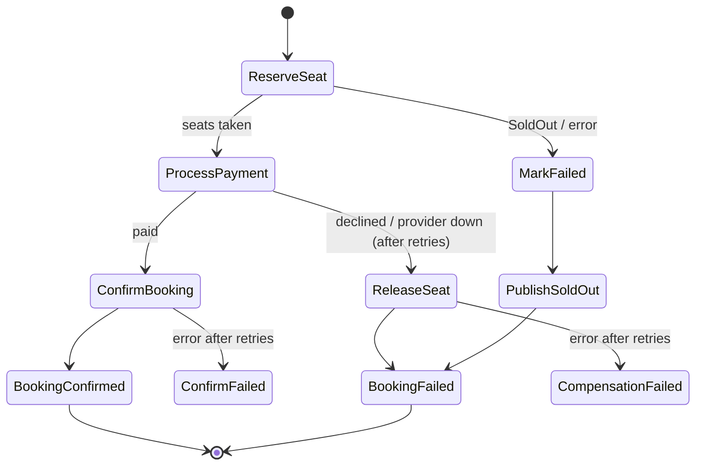

# Booking state machine (saga)

`booking-state-machine.asl.json` is the Amazon States Language definition. JSON has no comments, so this file
explains it. `stepfunctions.ts` replaces the `${...}` placeholders with real ARNs and table names.



## Why a saga?

Booking touches several things that can't share one database transaction: seats (DynamoDB), payment (an
external provider), notifications. A **saga** runs them as a sequence of local steps; when a later step fails,
**compensating** steps undo the earlier ones (`ReleaseSeat` undoes `ReserveSeat`). This saga is
**orchestrated**: one state machine decides what happens next (see docs/adr/0004-saga-orchestration.md).

## Query language: JSONata

`"QueryLanguage": "JSONata"` (AWS's current recommendation) replaces the older JSONPath fields
(`InputPath`, `Parameters`, `ResultSelector`, `ResultPath`, `OutputPath`) with two:
- `Arguments`: what to send to the task. `` = this state's input.
- `Output`: what this state passes on. `` = what the Lambda returned.

## States

| State | Type | What it does | Retries | On failure |
|---|---|---|---|---|
| `ReserveSeat` | Lambda | Seats − n and booking.seatReservedAt, one DynamoDB transaction | Lambda/transient errors: 2× (1s, 2s, full jitter) | `States.ALL` (incl. `SoldOut`) → `MarkFailed` (no seats were taken, nothing to undo). `States.ALL` must stand alone in `ErrorEquals` |
| `ProcessPayment` | Lambda | Fake payment; `.13` amounts are declined | `PaymentProviderUnavailable`: 3× exponential backoff with jitter (1s, 2s, 4s). `CircuitOpen`: 1× after 5s | → `ReleaseSeat` (compensation). The error is merged into the input as `error` |
| `ConfirmBooking` | Lambda | Booking → CONFIRMED, live seat update (AppSync), `BookingConfirmed` (EventBridge) | 3× | → `ConfirmFailed` (Fail: money taken, booking not confirmed, a human must act) |
| `ReleaseSeat` | Lambda | Compensation: seats + n, booking → FAILED with the reason, live update, `BookingFailed` | 3× | → `CompensationFailed` (Fail) |
| `MarkFailed` | **DynamoDB direct** | Booking → FAILED. No Lambda: Step Functions calls DynamoDB `UpdateItem` itself | 3× | — |
| `PublishSoldOut` | **EventBridge direct** | Publishes `BookingFailed` (with the reason) to the bus, like ReleaseSeat does on the payment path | 3× | — |
| `BookingConfirmed` / `BookingFailed` | Succeed | Both are *handled* outcomes, so the execution succeeds and no alarm fires | — | — |
| `ConfirmFailed` / `CompensationFailed` | Fail | Unhandled problems: the execution fails and the `booking-saga-failed` alarm fires | — | — |

## Retry vs Catch

- **Retry** = "try the same step again" (transient: timeouts, throttling, provider down). Backoff spreads the
  retries out; **jitter** randomises them so many executions don't retry in lockstep (thundering herd).
- **Catch** = "go somewhere else" (permanent: sold out, card declined, or retries used up).
- Business errors are matched by the error's **name** (`SoldOut`, `PaymentDeclined`), which the Lambda sets
  (`functions/shared/saga.ts`).

## Idempotent steps

Step Functions may run a task more than once (retries, at-least-once delivery). Every step is written so a
second run changes nothing: conditional writes on `seatReservedAt` and `status`. The execution **name** is the
`bookingId`, so the API can never start two sagas for one booking.

## Standard, not Express

Standard workflows run up to a year, keep a full visual history for 90 days and run each step exactly once
(Express: at-least-once, up to 5 minutes, cheaper at high volume). See docs/adr/0005-standard-workflow.md.

## Validate without deploying

`aws stepfunctions validate-state-machine-definition` is a read-only check. Replace the placeholders with any
well-formed ARNs first:

```bash
sed -e 's/\${[A-Za-z]*Arn}/arn:aws:lambda:us-east-1:123456789012:function:x/g; s/\${BookingsTable}/Bookings/; s/\${EventBusName}/ticketlite-dev/' \
  booking-state-machine.asl.json > /tmp/asl.json
AWS_PROFILE=ticketlite aws stepfunctions validate-state-machine-definition --definition file:///tmp/asl.json --type STANDARD
```
